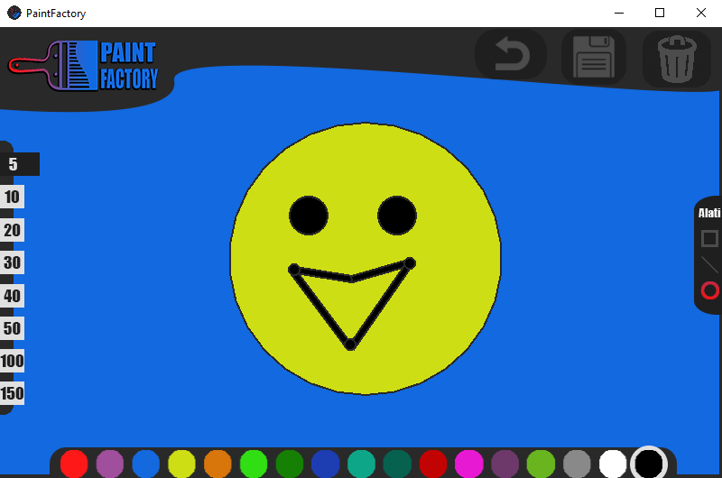

# Paint Factory

   

## Overview
Paint Factory is an intuitive drawing program designed for creating and editing vector objects such as lines, rectangles, and circles. With its simple and powerful tools, it’s perfect for quick sketches, technical diagrams, and creative projects.

---

Paint Factory je intuitivni program za crtanje i uređivanje vektorskih objekata poput linija, pravougaonika i krugova. Sa svojim jednostavnim i moćnim alatima, idealan je za brze skice, tehničke dijagrame i kreativne projekte.

---

## Features / Funkcionalnosti

- **English**
  - Draw and edit lines, rectangles, and circles with precision.
  - Intuitive interface for seamless design experience.
  - Export your projects as JPG.
  - Customize colors, rectangle size, line size, line angle, and circle size.
  - Functional undo button.
  - Functional clear button.

- **Bosanski**
  - Precizno crtanje i uređivanje linija, pravougaonika i krugova.
  - Intuitivan interfejs za jednostavno korištenje.
  - Izvoz projekata u JPG.
  - Jednostavno prilagođavanje boja, veličine pravougaonika, veličine linija, uglova linija i veličine krugova.
  - Funkcionalna undo tipka.
  - Funkcionalna clear tipka.

---

## Known Issues / Poznati problemi

- **English**
  - Holding the mouse click continuously can create a series of rectangle dots.
  - Each shape (circle, rectangle, line) is limited to 50 indices. Exceeding this limit will delete all drawn objects.
  - The save button always overwrites the same file named `scrn.jpg` in the root folder.

- **Bosanski**
  - Držanjem lijeve tipke miša bez prekida pojavljuju se serije tačkica pravougaonika.
  - Svaka figura (krug, pravougaonik, linija) ima ograničenje od 50 indeksa. Prekoračenjem tog limita brišu se svi nacrtani objekti.
  - Tipka za spremanje uvijek sprema u isti fajl nazvan `scrn.jpg` u osnovnom folderu.

---

## Getting Started / Početak

1. **English**: Download Paint Factory by downloading the repository zip or cloning the repository.
   - Unzip the file.
   - Open the unzipped folder.
   - Find the PaintFactory.exe program and run it.

2. **Bosanski**: Preuzmite Paint Factory tako što ćete preuzeti zip datoteku repozitorija ili klonirati repozitorij.
   - Otvorite zip datoteku.
   - Otvorite unzipovani folder.
   - Pronađite PaintFactory.exe program i pokrenite ga.

---

## Showcase / Primjeri

See Paint Factory in action: / Pogledajte Paint Factory u akciji.

_Drawing of a smiley face in Paint Factory./Crtanje smješka u Paint Factory-u._

---

## Support / Podrška

- **English**: Have questions or need help? Contact me at [harunridjevic@gmail.com](mailto:harunridjevic@gmail.com).
- **Bosanski**: Imate pitanja ili trebate pomoć? Kontaktirajte me na mail [harunridjevic@gmail.com](mailto:harunridjevic@gmail.com).

---

## Credits / Zasluge

- **English**: This project was created by me, Harun Riđević, in 2022 while finishing middle school.
- **Bosanski**: Ovaj projekat sam napravio ja, Harun Riđević, 2022. godine dok sam završavao osnovnu školu.

---

## License / Licenca

- **English**: This project is licensed under the MIT License.
- **Bosanski**: Ovaj projekat je licenciran pod MIT licencom.

---

Enjoy creating with Paint Factory! / Uživajte u kreiranju uz Paint Factory!

