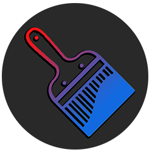
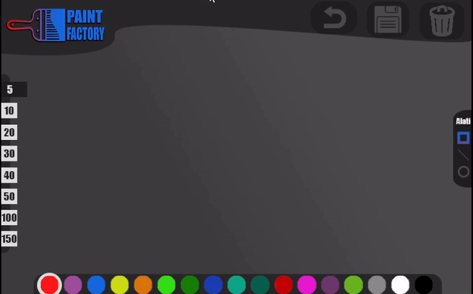

# Paint Factory

## Overview
Paint Factory is an intuitive drawing program designed for creating and editing vector objects such as lines, rectangles, and circles. With its simple and powerful tools, it’s perfect for quick sketches, technical diagrams, and creative projects.

---

Paint Factory je intuitivni program za crtanje i uređivanje vektorskih objekata poput linija, pravougaonika i krugova. Sa svojim jednostavnim i moćnim alatima, idealan je za brze skice, tehničke dijagrame i kreativne projekte.

---

## Features / Funkcionalnosti

- **English**
  - Draw and edit lines, rectangles, and circles with precision.
  - Intuitive interface for seamless design experience.
  - Export your projects JPG.
  - Customize colors, rectangle size, line size, line angle and circle size.
  - Functional undo button.
  - Functional clear button.

- **Bosanski**
  - Precizno crtanje i uređivanje linija, pravougaonika i krugova.
  - Intuitivan interfejs za jednostavno korištenje.
  - Izvoz projekata u JPG.
  - Jednostavno prilagođavanje boja, veličine pravougaonika, veličine linija, uglova linija i veličine krugova.
  - Funkcionalna undo tipka.
  - Funkcionalna clear tipka.

---

## Getting Started / Početak

1. **English**: Download Paint Factory by downloding the repository zip or cloning the repository.
   - Unzip the file.
   - Open the unzipped folder.
   - Find the PaintFactory.exe program and run it.

2. **Bosanski**: Preuzmite Paint Factory tako što ćete preuzeti zip datoteku repozitorija ili klonirati repozitoriji.
   - Unzipujte fajl.
   - Otvorite unzipovani folder.
   - Pronađite PaintFactory.exe program i pokrenite ga.

---

## Showcase / Primjeri

  See Paint Factory in action: / Pogledajte Paint Factory u akciji.
  
  

  

---

## Support / Podrška

- **English**: Have questions or need help? Contact us at [harunridjevic@gmail.com](mailto:harunridjevic@gmail.com).
- **Bosanski**: Imate pitanja ili trebate pomoć? Kontaktirajte nas na [harunridjevic@gmail.com](mailto:harunridjevic@gmail.com).

---

## License / Licenca

- **English**: This project is licensed under the MIT License.
- **Bosanski**: Ovaj projekat je licenciran pod MIT licencom.

---

Enjoy creating with Paint Factory! / Uživajte u kreiranju uz Paint Factory!

